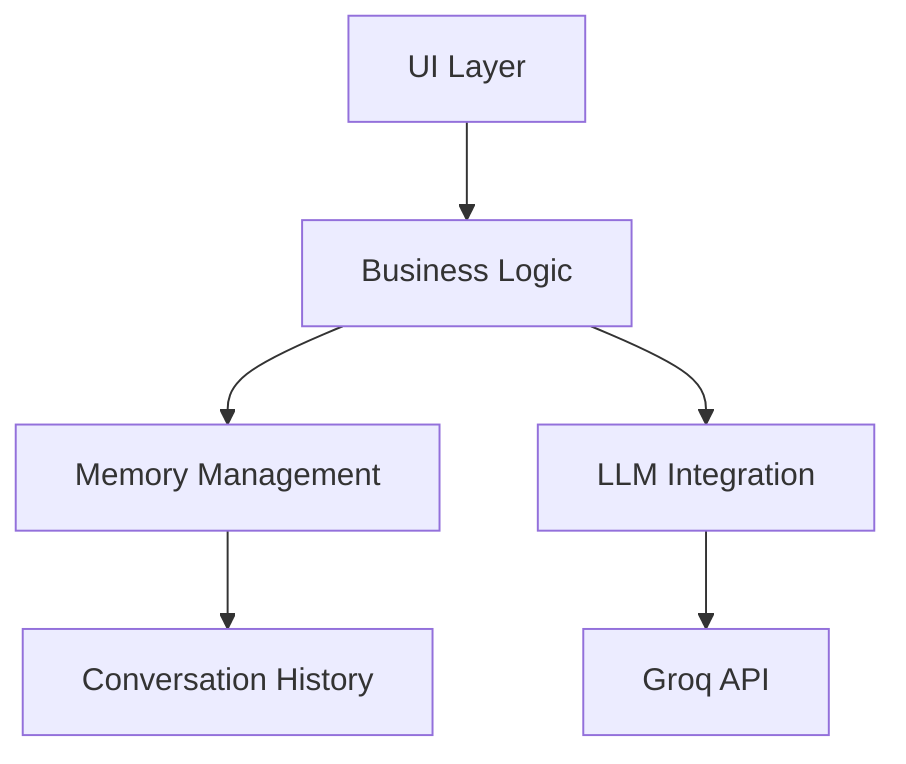

# Conversational Chatbot with GROQ – Multi-Domain Expertise 🤖✨

This repository contains a multi-domain expert **Conversational Chatbot** powered by **GROQ's large language models (LLMs)**. It is designed to provide intelligent, context-aware, and accurate responses across various domains like healthcare, education, finance, travel, etc.


## Features

- Multiple AI personas (Expert, Creative, Technical)
- 7 specialized knowledge domains
- Real-time conversation analytics
- Docker/Kubernetes ready
- CI/CD pipeline
- Responsive UI with dark/light mode

## Quick Start

```bash
# Clone repo
git clone https://github.com/Shubam081220/Conversational-Chatbot-GROQ
cd GENE.ai
```
# Setup environment
cp .env.example .env
# Add your GROQ_API_KEY in .env

# Run with Docker
docker-compose up -d

Access at: http://localhost:8501

Deployment Options
Deploy on Railway
Deploy on Render

Documentation
Full documentation available in docs/ folder:

Architecture

API Reference

Development Guide


**.github/workflows/ci-cd.yml**:
```yaml
name: CI/CD Pipeline

on:
  push:
    branches: [ main ]
  pull_request:
    branches: [ main ]

jobs:
  test:
    runs-on: ubuntu-latest
    steps:
    - uses: actions/checkout@v4
    - name: Set up Python
      uses: actions/setup-python@v4
      with:
        python-version: '3.9'
    - name: Install dependencies
      run: |
        python -m pip install --upgrade pip
        pip install -r requirements.txt
        pip install pytest pytest-cov
    - name: Run tests
      run: |
        pytest --cov=app --cov-report=xml
    - name: Upload coverage
      uses: codecov/codecov-action@v3

  deploy:
    needs: test
    runs-on: ubuntu-latest
    if: github.ref == 'refs/heads/main'
    steps:
    - uses: actions/checkout@v4
    - name: Build Docker image
      run: docker build -t nexusai-assistant .
    - name: Log in to Docker Hub
      uses: docker/login-action@v2
      with:
        username: ${{ secrets.DOCKER_HUB_USERNAME }}
        password: ${{ secrets.DOCKER_HUB_TOKEN }}
    - name: Push to Docker Hub
      run: |
        docker tag nexusai-assistant ${{ secrets.DOCKER_HUB_USERNAME }}/nexusai-assistant:latest
        docker push ${{ secrets.DOCKER_HUB_USERNAME }}/nexusai-assistant:latest
```
pyproject.toml (Modern Python config):

``` bash
[project]
name = "nexusai-assistant"
version = "0.1.0"
description = "Advanced AI assistant powered by Groq"
authors = [
    {name = "Your Name", email = "your@email.com"}
]
readme = "README.md"
requires-python = ">=3.9"
license = {text = "MIT"}

[project.urls]
Homepage = "https://github.com/yourusername/nexusai-assistant"
Documentation = "https://github.com/yourusername/nexusai-assistant/docs"

[tool.setuptools.packages.find]
where = ["app"]

[tool.pytest.ini_options]
python_files = "test_*.py"
testpaths = ["tests"]
```
3. Initialize Git Repository
bash
# Initialize git
git init

# Create main branch
git checkout -b main

# Add files
git add .

# Initial commit
git commit -m "Initial commit: NexusAI Assistant"

# Create GitHub repo and push
gh repo create nexusai-assistant --public --source=. --remote=origin
git push -u origin main
4. Recommended GitHub Repository Settings
Branch Protection Rules:

- Require pull request reviews
- Require status checks to pass
- Require linear history

# Secrets:

-DOCKER_HUB_USERNAME
-DOCKER_HUB_TOKEN
-GROQ_API_KEY (for CI tests)

# Features:

- Enable Discussions
- Set up Project board
- Configure CODEOWNERS

# Labels:

- enhancement
- bug
- documentation
- question

5. Documentation Files
docs/architecture.md:

markdown
# System Architecture



# Components
UI Layer:

- Streamlit-based interface
- Responsive layouts
- Dark/light mode support

# Business Logic:

- Conversation management
- Domain-specific processing
- Analytics generation

# Memory:

- Short-term conversation memory
- Knowledge base persistence


**docs/setup.md**:


# Development Setup

## Local Development

```bash
python -m venv .venv
source .venv/bin/activate  # Linux/Mac
.\.venv\Scripts\activate   # Windows

pip install -e .
Environment Variables
Create .env file:

ini
GROQ_API_KEY=your_key_here
STREAMLIT_SERVER_PORT=8501
```
This complete GitHub repository setup includes:
- Proper Python project structure
- CI/CD pipeline
- Comprehensive documentation
- Modern packaging configuration
- Docker/Kubernetes support
- Testing infrastructure
- Issue templates (can be added in .github/ISSUE_TEMPLATE/)
- All necessary configuration files
